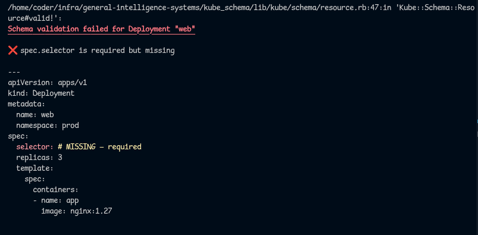

# kube_schema

Ruby objects for every Kubernetes resource. Validated against the real OpenAPI spec.

```ruby
Kube::Schema["Deployment"].new {
  metadata.name = "web"
  metadata.namespace = "prod"
  spec.replicas = 3
  spec.template.spec.containers = [
    { name: "app", image: "nginx:1.27", ports: [{ containerPort: 80 }] }
  ]
}
```

No YAML. No hash literals. Just Ruby blocks that know their schema.

## Contents

- [Install](#install)
- [Resources](#resources)
- [The block DSL](#the-block-dsl)
- [Subclassing](#subclassing)
- [Validation](#validation)
- [Error messages](#error-messages)
- [Manifests](#manifests)
  - [File I/O](#file-io)
  - [Composition](#composition)
  - [Enumerable](#enumerable)
- [Schema versions](#schema-versions)
- [Related projects](#related-projects)
- [Built with](#built-with)

## Install

```
gem install kube_schema
```

## Resources

Every Kubernetes kind is a class. Fetch it by name.

```ruby
Kube::Schema["Deployment"]     # => Class < Kube::Schema::Resource
Kube::Schema["Service"]
Kube::Schema["ConfigMap"]
Kube::Schema["NetworkPolicy"]
```

Specific versions:

```ruby
Kube::Schema["1.34"]["Deployment"]
Kube::Schema["1.31"]["Pod"]
```

Discovery:

```ruby
Kube::Schema.schema_versions    # => ["1.19", "1.20", ..., "1.35"]
Kube::Schema.latest_version     # => "1.35"

Kube::Schema["1.34"].list_resources
# => ["Binding", "CSIDriver", "ConfigMap", "Deployment", ...]
```

## The block DSL

Nested attributes just work. No intermediate hashes, no string keys.

```ruby
deploy = Kube::Schema["Deployment"].new {
  metadata.name = "web"
  metadata.namespace = "prod"
  metadata.labels = { app: "web" }

  spec.replicas = 3
  spec.selector.matchLabels = { app: "web" }

  spec.template.metadata.labels = { app: "web" }
  spec.template.spec.containers = [
    { name: "app", image: "nginx:1.27", ports: [{ containerPort: 80 }] }
  ]
}
```

`apiVersion` and `kind` are derived from the schema automatically:

```ruby
deploy.to_h[:apiVersion]  # => "apps/v1"
deploy.to_h[:kind]        # => "Deployment"
```

## Subclassing

```ruby
class RailsApp < Kube::Schema["Deployment"]
  def default_image
    "ruby:3.4"
  end
end

app = RailsApp.new {
  metadata.name = "rails"
  spec.template.spec.containers = [
    { name: "web", image: "myapp:latest" }
  ]
}

app.default_image  # => "ruby:3.4"
app.valid?         # => true
```

## Validation

Every resource validates against the full Kubernetes OpenAPI spec.

```ruby
deploy.valid?   # => true

bad = Kube::Schema["Deployment"].new {
  self.apiVersion = 12345
}

bad.valid?   # => false

bad.valid!
# Kube::ValidationError: Schema validation failed for Deployment:
#   - apiVersion = 12345 — expected string, got Integer
```

`to_yaml` refuses to serialize invalid resources:

```ruby
bad.to_yaml  # raises Kube::ValidationError
```

## Error messages

Validation errors render annotated YAML with color-coded diagnostics. Error lines are highlighted in red, missing required keys are injected inline, and each problem gets a clear explanation:



## Manifests

Group resources into multi-document YAML.

```ruby
manifest = Kube::Schema::Manifest.new

manifest << Kube::Schema["Namespace"].new {
  metadata.name = "prod"
}

manifest << Kube::Schema["Deployment"].new {
  metadata.name = "web"
  metadata.namespace = "prod"
  spec.replicas = 3
  spec.template.spec.containers = [
    { name: "app", image: "nginx:1.27" }
  ]
}

manifest << Kube::Schema["Service"].new {
  metadata.name = "web"
  metadata.namespace = "prod"
  spec.selector = { app: "web" }
  spec.ports = [{ port: 80, targetPort: 8080 }]
}

puts manifest.to_yaml
```

```yaml
---
apiVersion: v1
kind: Namespace
metadata:
  name: prod
---
apiVersion: apps/v1
kind: Deployment
metadata:
  name: web
  namespace: prod
spec:
  replicas: 3
  ...
---
apiVersion: v1
kind: Service
metadata:
  name: web
  namespace: prod
spec:
  selector:
    app: web
  ports:
  - port: 80
    targetPort: 8080
```

### File I/O

```ruby
# Write
manifest.write("cluster.yaml")

# Read
loaded = Kube::Schema::Manifest.open("cluster.yaml")

# Modify and write back
loaded << new_resource
loaded.write
```

### Composition

Manifests flatten into each other. No nesting.

```ruby
infra = Kube::Schema::Manifest.new(namespace, configmap, secret)
app   = Kube::Schema::Manifest.new(deployment, service)

combined = Kube::Schema::Manifest.new
combined << infra
combined << app
combined.size  # => 5
```

### Enumerable

```ruby
manifest.map { |r| r.to_h[:kind] }
manifest.select { |r| r.to_h[:kind] == "Service" }
manifest.any? { |r| r.to_h[:kind] == "Pod" }
manifest.count
```

## Schema versions

Bundled schemas ship with the gem for Kubernetes 1.19 through 1.35. Updated automatically via CI.

```ruby
Kube::Schema.schema_version = "1.31"
Kube::Schema["Deployment"]  # uses 1.31
```

## Related projects

- [kube_cluster](https://github.com/general-intelligence-systems/kube_cluster) -- OOP resource management with dirty tracking and persistence
- [kube_kubectl](https://github.com/general-intelligence-systems/kube_ctl) -- Ruby DSL that compiles to kubectl and helm commands
- [kube_kit](https://github.com/general-intelligence-systems/kube_kit) -- Generators for kube_cluster projects
- [kube_engine](https://github.com/general-intelligence-systems/kube_engine) -- Kubernetes engine

## Built with

[json_schemer](https://github.com/davishmcclurg/json_schemer) -- JSON Schema validation against the real Kubernetes OpenAPI specs.
